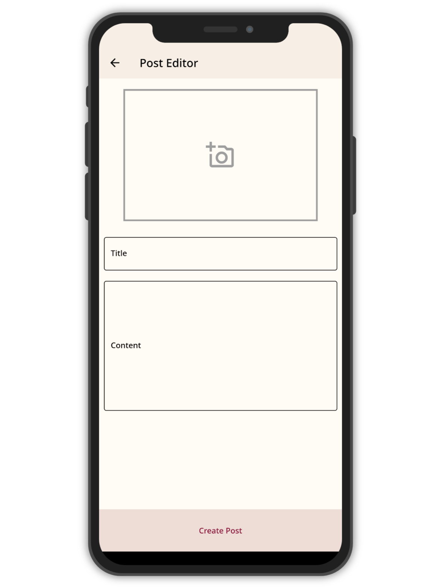

# Simple Blogging App
The Simple Blogging App is a mobile application that allows users to read, write, edit, and delete their own blog posts. The app is built using the Flutter framework, a popular open-source mobile app development SDK that enables developers to build high-performance, cross-platform apps for iOS and Android.

> **Note:** This project uses Node.js API, A Firebase version of this project can be found on [**firebase-main**](https://github.com/shivanuj13/simple_blogger/tree/firebase-main) branch.

## Screenshots
<p align="center">
  
    
    
    
    
    
    
</p>


## Technical Details
The Simple Blogging App uses the following technologies:
- [Flutter](https://flutter.dev/) - an open-source UI software development kit created by Google. It is used to develop applications for Android, iOS, Linux, Mac, Windows, Google Fuchsia, and the web from a single codebase.
- [Node.js](https://nodejs.org/en/) - an open-source, cross-platform, back-end JavaScript runtime environment that runs on the V8 engine and executes JavaScript code outside a web browser.
- [Shared Preferences](https://pub.dev/packages/shared_preferences) - a Flutter plugin for reading and writing simple key-value pairs. Perfect for storing simple data like user preferences.

## Features
- User authentication
- User profile management with Mongo DB
- Blog post management with Mongo DB
- Blog post image upload with [Cloudinary](https://cloudinary.com/)
- Simple and minimal UI design
- Fluid animations

## Requirements
- Android 5.0 (Lollipop) and above.
- Android SDK installed on the development environment. See the [Android SDK installation guide](https://developer.android.com/studio) for more details.
- Flutter framework installed. See the [Flutter installation guide](https://flutter.dev/docs/get-started/install) for more details.

## Getting Started
- Clone the repository and open the project in your favorite IDE.
- Set up a Firebase project and enable Authentication, Cloud Firestore and Cloud Storage.
Add the Firebase configuration file to the android/app directory.
- Run the following command to install the required packages:
```bash
flutter pub get
```
- Run the app on an Android device or emulator. by running the following command:
```bash
flutter run
```

## Contributing
Contributions are welcome! If you find any bugs or have suggestions for new features, feel free to open an issue or submit a pull request.

## License
The Simple Blogging App is released under the MIT License. Feel free to use and modify the code for your own projects.